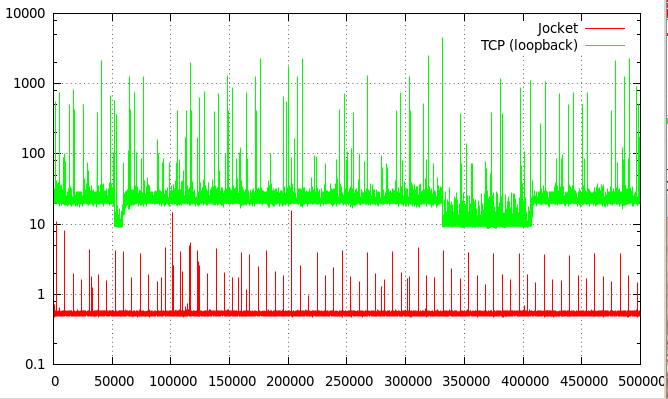

Jocket
======

Low-latency replacement for Java sockets, using shared memory.


Status
------

Current benchmarks show a 10-100x performance improvement when compared to a standard socket.

The following chart displays the RTT latency (in microseconds) between two processes:
 - the client sends a PING request (payload = 4 bytes)
 - the server replies with a PONG response (payload = 1024 bytes)



This benchmark was run on an Intel Core i5-2500.

Jocket is young and still under development. It has been tested only on Linux.

API
---

Currently, there are 2 APIs:
 - JocketReader/JocketWriter: low-level, non blocking API
 - JocketSocket: high-level, blocking API mimicking java.net.Socket

The benchmark used to generate the above diagram is based on the JocketSocket API.

How it works
------------

Jocket is built around a concept of shared buffer, accessed by a reader and a writer.

`JocketWriter.write()` can be called several times to append data to the buffer. When `JocketWriter.flush()` is called, a packet is flushed and can immediately be read by `JocketReader.read()`.

The buffer is bound by a double capacity:
 - the maximum number of packets that can be written without being read
 - the maximum number of bytes that can be written without being read

When any of these limits is reached, `JocketWriter.write()` does nothing and returns zero. As soon as `JocketReader.read()` is called, it is again possible to write data.

The reader and writer can be:
 - in the same process: allows to transfer efficiently a stream of bytes from a thread to another
 - in two different processes: allows to transmit data between two local processes faster than with a TCP socket

To implement a bidirectional socket, two shared buffers are required, each wrapping an mmap'ed file.

For convenience, the current jocket API closely mimics the java.net API, eg.


```java
// server
ServerJocket srv = new ServerJocket(4242);
JocketSocket sock = srv.accept();

// client
JocketSocket sock = new JocketSocket(4242);
InputStream in = sock.getInputStream();
OutputStream out = sock.getOutputStream();
```

Otherwise, Jocket readers and writers have their own API allowing to perform non-blocking read/writes, potentially faster than with input/output streams.


Known issues
------------

### Spinning vs Sleeping

The JocketSocket API transforms a non-blocking API into a blocking API. When data can't be read or written, the program must wait. The default waiting strategy is to spin, then yield(), then parkNanos(), then Thread.sleep().

This has the following disadvantages:
 - high CPU usage for a small amount of time
 - greater latency after a while

I'll experiment with *futex*es (with JNI and Unsafe) to see whether a spin-parkNanos-WAIT strategy is possible.

Credits
-------

This project takes some ideas from @mjpt777 and @peter-lawrey
